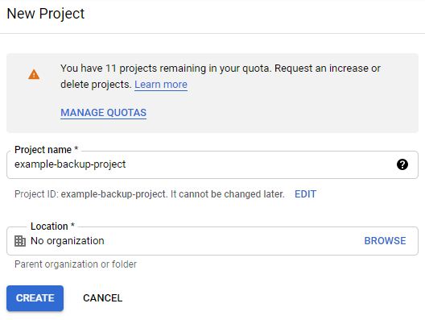
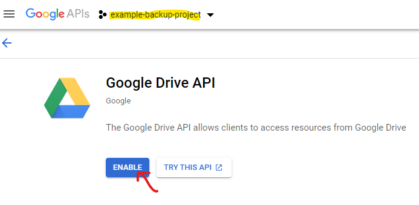
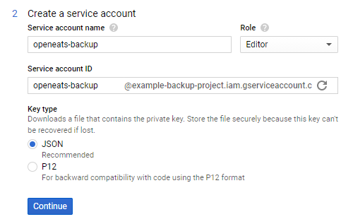
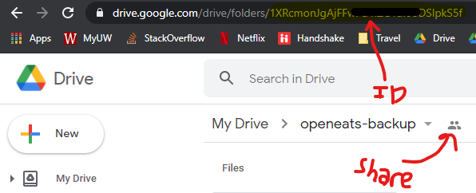

# Automatic Backups

I've had lots of issues in the past where Raspberry Pi's get their power cycled accidentally, and the whole image fails.
As a safeguard incase this happens, I've developed a script to automatically back up the database and images to Google Drive.
In order for the script to run, you will need to setup your own Google APIs account for the Drive API, and the backup.py script
in this repository will need to be set as a cron job.  This doc will walk through the steps to set this up.

Note that you could choose another cloud provider for backups such as OneDrive or Box, but you'd need to modify backup.py to use their API.

## Setting up Google API Project

One thing to note is Google seems to change their APIs quite often.  I cannot promise these instructions will stay up-to-date.

To backup files to Google Drive, you will need to head over to the [Google APIs Dashboard](https://console.developers.google.com/)
and create a new project.  I named mine `example-backup-project`.



Once the project is created open that project in the dashboard and click on `Enable APIs and Services`.  Search for `Drive` and enable the Google Drive API.



### Creating a Service Account and Setting up Credentials

Once the project is created, you'll need to add a service account.  Click on the `Create Credentials` button from the dashboard.  For me, this brought up a questionare to figure out what type of account was needed.  Since I'm using the Google Drive API for a cron job to get application data, it recommended a service account.

I gave my service account a name (`openeats-backup`) and gave it the `Project->Editor` role.  I kept the key type as `json`.

Note the Service account ID.  This is the email address for the service account that we use later to share our Google Drive folder with.



When I clicked continue, it automatically downloaded the json credentials file.  Save the file, we'll need it later.



### Creating the Google Drive Backup Folder

Next we'll need to create a folder in our own Google Drive account where we can dump the backups.  Go to your own Drive (not the service user) and create a new folder.  

Share the folder with the service account email address.  That will allow the API to upload files to this folder.

Note that the folder ID can be found in the URL when you're viewing the folder from your browser.  We will need that ID later.

## Configuring the Backup to Run Automatically

With that the API is all setup on the cloud.  Next we need to configure a few things on the Raspberry Pi.

### Copy the Credentials File

First, copy the json credentials file for your service account to the OpenEats directory on the Raspberry Pi.  I used [pscp](https://www.ssh.com/ssh/putty/putty-manuals/0.68/Chapter5.html) to do that from my Windows computer.

```bash
pscp my-creds-file.json pi@192.169.0.199:OpenEats
```

### Set Variables in env_prod.list

The `backup.py` file is what takes care of the backups.  It reads values from the `env_prod.list` file you created when setting up OpenEats.  

In that file, change `GOOGLE_DRIVE_CREDENTIALS_FILE` to the absolute path of the json file you just copied to the RPi.  

Change GOOGLE_DRIVE_BACKUP_FOLDER_ID to the folder ID found in the URL when viewing the Google Drive folder from a web browser (not the full URL, just the ID).

### Install packages for pip

The backup.py script requires a few modules to be installed for the Google Drive API.  Install them by running:

```bash
python3 -m pip install --upgrade google-api-python-client google-auth-httplib2 google-auth-oauthlib
```

At this point you should be able to run the script.  Once you run it you should see a zip file appear in your Google Drive folder.

### Copy script to cron directory

The easiest way to automatically run a script at a given interval is to put it in one of the `/etc/cron` directories.  `/etc/cron.hourly`, `/etc/cron.daily`, `/etc/cron.weekly`, and `/etc/cron.monthly` run the scripts in those folders hourly, daily, weekly, and monthly respectively.  I recommend copying the folder into the weekly or monthly directory.  Note that scripts in these folders cannot have file extensions, and they will run as root.

```bash
sudo chmod +x backup.py
sudo cp ./backup.py /etc/cron.weekly/openeats-backup
```

# Backing up Your Data Manually

The following commands can be used to take backups of your data and restore those backups. The backup commands are automatically run when you upgrade to a newer version as well.


### Recipes Images

#### Backing up:

Replace `/dir/on/local/system/` with the location where you would like your images.
```sh
docker cp openeats_api_1:/code/site-media/ /dir/on/local/system/
```

#### Restoring:

Replace `/dir/on/local/system/` with the location where you would like your images.
```sh
docker cp /dir/on/local/system/site-media/. openeats_api_1:/code/site-media/ 
```

### Database

#### Backing up:

Places a sql dump of the database on your current working directory.
```sh
docker exec openeats_db_1 sh -c 'exec mysqldump openeats -uroot -p"$MYSQL_ROOT_PASSWORD"' > openeats.sql
```

#### Restoring:

First cd into the dir that contains your sql backup. Once there you need to source your env file so you don't have to type your database password on the command line. Then run the last command to start the restore.
Note: if you changed the database name then you will need to change the last word the statement below to the database name you gave OpenEats.
```sh
cd /open/eats/root/
source env_prod.list
cat openeats.sql | docker exec -i openeats_db_1 /usr/bin/mysql -u root -p"$MYSQL_ROOT_PASSWORD" openeats

```


### Sources
- [Copying Image Files to and from Docker Containers/Volumes](https://gist.github.com/spalladino/6d981f7b33f6e0afe6bb)
- [DB backups/restores](https://stackoverflow.com/questions/22907231/copying-files-from-host-to-docker-container)
